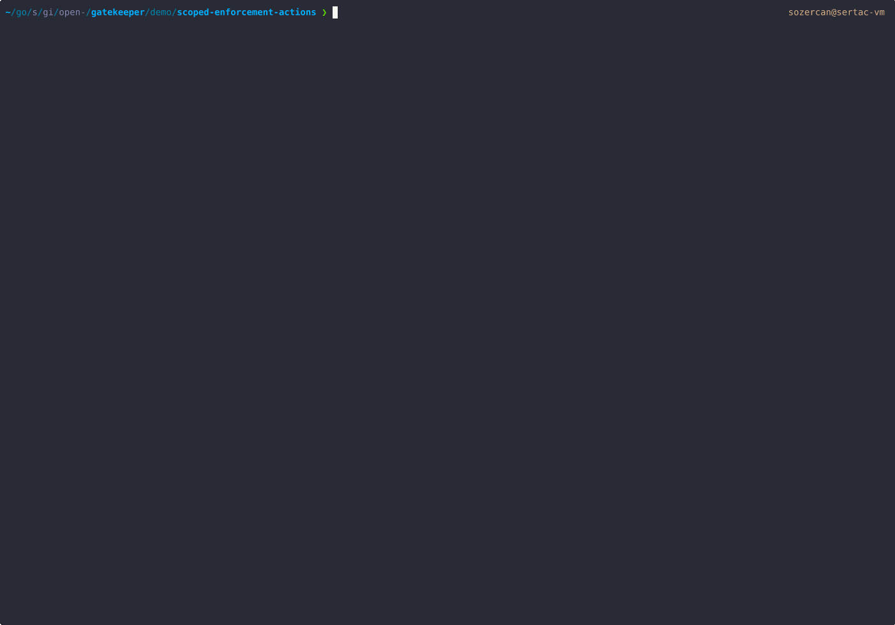

> [!WARNING]
> This is a demo of an alpha feature and is subject to change.

This demo shows:

1. Configuring different validation actions for different enforcement points.
2. Integration with VAP as enforcement point such that admission validation can be handled by [Kubernetes's in-process Validating Admission Policy Controller](https://kubernetes.io/docs/reference/access-authn-authz/validating-admission-policy/) instead of the Gatekeeper admission webhook. In the event the Validating Admission Policy Controller fails open, then Gatekeeper admission webhook can act as a fallback. This requires clusters with the Kubernetes Validating Admission Policy feature enabled.

Please refer to <https://open-policy-agent.github.io/gatekeeper/website/docs/next/validating-admission-policy> for pre-requisites and configuration steps.

## Demo

