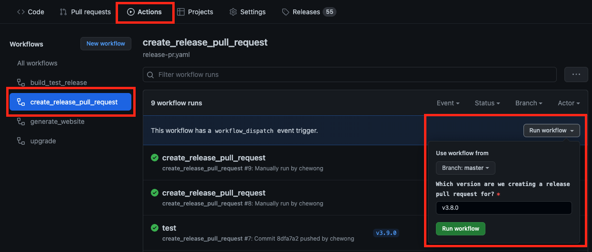

# Release Process

## Overview

The release process consists of three phases: versioning, building, and publishing.

Versioning involves maintaining the following files:
- **Makefile** - the Makefile contains a VERSION variable that defines the version of the project.
- **manager.yaml** - the controller-manager deployment yaml contains the latest release tag image of the project.
- **gatekeeper.yaml** - the gatekeeper.yaml contains all gatekeeper resources to be deployed to a cluster including the latest release tag image of the project.

The steps below explain how to update these files. In addition, the repository should be tagged with the semantic version identifying the release.

Building involves obtaining a copy of the repository and triggering a build as part of the GitHub Actions CI pipeline.

Publishing involves creating a release tag and creating a new *Release* on GitHub.

## Cherry picking

There is an optional script for cherry picking PRs that should make the process easier.

Prerequisites:
- `hub` binary is installed. If not, `hub` can be installed by `go get github.com/github/hub`.
- Set GitHub user name with `export GITHUB_USER=<your GitHub username>`
- Set fork remote with `export FORK_REMOTE=<your fork remote name, by default it is "origin">`
- Set upstream remote with `export UPSTREAM_REMOTE=<upstream remote name, by default it is "upstream">`

Usage: `./third_party/k8s.io/kubernetes/hack/cherry_pick_pull.sh upstream/release-3.1 123`
For example, this will cherry pick PR #123 into `upstream/release-3.1` branch and will create a PR for you.

You can also combine multiple PRs by separating them with spaces (`./third_party/k8s.io/kubernetes/hack/cherry_pick_pull.sh upstream/release-3.1 123 456`)

If you want to run the script with dry run mode, set `DRY_RUN` to `true`.

Cherry pick script is copied over from https://github.com/kubernetes/kubernetes/blob/master/hack/cherry_pick_pull.sh. For more information, see https://github.com/kubernetes/community/blob/master/contributors/devel/sig-release/cherry-picks.md

## Release Cadence

There are three version tracks for the Gatekeeper project:

1. Beta (`vX.Y.Z-beta.A`)
1. Release Candidate (`vX.Y.Z-rc.B`)
1. Stable (`vX.Y.Z`)

After a minor release (`vX.Y.0`) has been released, we will immediately tag the master branch with `vX.Y+1.Z-beta.0` in preparation for our next minor release (`vX.Y+1.0`). We will periodically increment the beta version (e.g. `vX.Y+1.Z-beta.0` -> `vX.Y+1.Z-beta.1`) to give the users a chance to test bug fixes and experimental features we introduce to the master branch. However, we do not recommend using beta versions of Gatekeeper in a production environment.

Once we are ready to release the new minor version, we will create a release branch (`release-X.Y+1`) from the master branch and create a release candidate tag (`vX.Y+1.Z-rc.0`) based on the release branch. This allows us to isolate the release candidates in its own branch so that future pull requests that are being merged to the master branch will not cause any regressions. Unlike beta, we only increment our release candidates (e.g. `vX.Y+1.Z-rc.0` -> `vX.Y+1.Z-rc.1`) when we decided to cherry-pick merged pull requests to the release branch. We also do not recommend using release candidates of Gatekeeper in a production environment.

Once we are confident in our latest release candidate, we will tag the release branch with a stable release (`vX.Y+1.0`), and the development cycle will start all over again. We recommend using stable releases of Gatekeeper in a production environment. We also encourage users to upgrade to the latest stable patch releases (`vX.Y+1.Z`) for bug fixes, security fixes, and performance improvements.

For patch releases (e.g. `vX.Y.1`), refer to the [cherry picking](#cherry-picking) section on how to cherry-pick merged pull requests to an existing release branch.

## Release Pull Requests

Before we cut a release, we need to create a release pull request against the HEAD of the release branch. Once it is merged, we will create the release tag on the latest commit. We have a [GitHub Actions workflow](https://github.com/open-policy-agent/gatekeeper/actions/workflows/release-pr.yaml) that automates the creation of release pull requests.



1. Click the "Actions" tab.

1. Click the "create_release_pull_request" workflow.

1. Click "Run workflow" and input the version you would like to create a release pull request for.

During the workflow, it will create the release manifests, promote the manifests from `manifest_staging/charts` and `manifest_staging/deploy` to `charts` and `deploy` folders respectively, and create the release pull request on behalf of the release author.

## Building and releasing

1. Once the release pull request is merged to `master` or `release` branch (`<BRANCH NAME>` below), tag that commit with release version and push tags to remote repository.

	```
	git checkout <BRANCH NAME>
	git pull origin <BRANCH NAME>
	git tag -a <NEW VERSION> -m '<NEW VERSION>'
	git push origin <NEW VERSION>
	```

1. Pushing the release tag will trigger GitHub Actions to trigger `tagged-release` job.
This will build the `openpolicyagent/gatekeeper` image automatically, Then publish the new release image tag and the `latest` image tag to the `openpolicyagent/gatekeeper` repository. Finally, verify step will run e2e tests to verify the new released tag.

## Publishing

1. GitHub Action will create a new release, review and edit it at https://github.com/open-policy-agent/gatekeeper/releases
