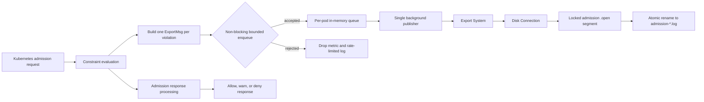

# Admission Violation Export Design

**Status**: Proposed
**Tracking Issue**: [#2798](https://github.com/open-policy-agent/gatekeeper/issues/2798)
**Created**: 2026-07-29
**Last Updated**: 2026-07-30

## Summary

Gatekeeper can export violations found during admission so that denied, warned,
and dry-run requests can be consumed outside the Kubernetes admission response.
Admission export reuses the existing `Connection` resource, export system, disk
driver configuration, channel, path, and volume used by audit export.

The admission webhook is latency-sensitive. Export is therefore best-effort and
asynchronous: the webhook encodes each violation and attempts a non-blocking send
to a bounded in-memory queue. A controller-runtime runnable drains the queue and
publishes records through the existing export system. Backend latency or failure
cannot change the admission decision, and the webhook never waits for backend I/O
or queue capacity. JSON encoding and the non-blocking enqueue attempt still run
on the admission path.

The supported alpha deployment uses the disk driver. Admission records are
written as durable JSON Lines segments with a separate filename prefix and
lifecycle from audit files. Audit and webhook publishers report health
independently in `ConnectionPodStatus`.

## Related Designs

This design builds on the following existing designs:

- [Connection config CRD and controller for Export](https://docs.google.com/document/d/12P3LCaOAQO9Uts4cVljHXkRgukEyWqyLketDP0rFq8A/edit)
- [Export Audit Violations without PubSub](https://docs.google.com/document/d/19sguUYd_VVhf2Gmy2SLMx1fwaxvrdqLxes3hTVH0DhU/edit)
- [Export violations using pub-sub](https://docs.google.com/document/d/1xu6c99m_qBOpztAc8uUnoY6ST8UiXyyJzrXOmMmJQ9I/edit)
- [Gatekeeper Resource Status Design](https://docs.google.com/document/d/1kPb3B1I6FBsthpR6hp0Q3SEB11iXoSSuWbj9t1q-_58/edit)

## Motivation

Audit export observes resources that already exist in the cluster. It cannot
fully represent admission-time policy outcomes:

- A denied object is never persisted and cannot later be found by audit.
- Admission warnings and dry-run violations occur in the request path.
- Consumers may need request identity, operation, requested resource, and
  subresource information that is not available from a stored object.

Calling an export backend synchronously from the validating webhook would couple
cluster write availability and latency to the backend. A slow disk, unavailable
connection, or blocked consumer could delay every matching Kubernetes request.
Admission export needs a bounded failure domain that preserves admission
availability while making loss observable.

## Goals

- Export one record for each valid constraint violation produced by the
  validating webhook.
- Include admission-request metadata needed to understand violations for objects
  that may never be persisted.
- Keep backend I/O off the admission response path.
- Bound webhook memory and shutdown work.
- Reuse the existing `Connection`, export system, audit route, disk path, and
  volume rather than expose a second transport configuration.
- Allow audit and admission files to coexist without either reader or retention
  policy consuming the other source's files.
- Report audit and webhook publishing health independently per pod.
- Surface overload and loss through metrics and rate-limited logs.
- Recover complete records from abandoned disk segments after a crash.

## Non-Goals

- Exactly-once or at-least-once delivery.
- Retrying an individual failed admission publish.
- Persisting the in-memory webhook queue across pod restarts.
- Blocking or changing an admission response because export failed.
- Supporting admission export through Dapr in the alpha Helm configuration.
- Multiple admission Connections or channels.
- Admission-specific public spool tuning in the alpha API.
- Coordinating one shared writable disk directory across Gatekeeper pods.
- Providing a production log shipper. The included reader sidecar is a
  demonstration and end-to-end test utility.

## Terminology

- **Admission violation**: a valid constraint result evaluated by the validating
  webhook, regardless of whether its enforcement action denies, warns, or
  records a dry-run result.
- **Producer**: the webhook request goroutine that constructs and attempts to
  enqueue a violation record.
- **Publisher**: the single background runnable that removes queued records and
  calls the export system.
- **Ready segment**: a finalized admission `.log` file available to a reader.
- **Open segment**: a locked admission `.open` file receiving JSON Lines records.
- **Source**: the component reporting publish status, currently `audit` or
  `webhook`.

## Configuration

Admission export is disabled by default and enabled independently from audit
export:

```text
--enable-admission-violation-export=true
```

Admission export deliberately reuses the audit route:

```text
--audit-connection=audit-connection
--audit-channel=audit-channel
```

Only one Connection and one channel are supported for this alpha design. The
Helm configuration is:

```yaml
enableAdmissionViolationExport: true
exportBackend: disk
audit:
  connection: audit-connection
  channel: audit-channel
  exportConnection:
    path: /tmp/violations/topics
    maxAuditResults: 3
  exportVolumeMount:
    path: /tmp/violations
  exportVolume:
    name: tmp-violations
    emptyDir: {}
admission:
  disableExportSidecar: true
```

The chart uses one top-level `exportBackend` for both audit and admission
export; there is no admission-specific backend setting. The chart creates the
shared disk `Connection`, mounts the audit export volume in each
controller-manager pod, and can optionally add the demonstration admission
reader sidecar when `exportBackend` is `disk`. Helm rendering fails when
admission export is enabled with any other backend. Operators deploying without
the chart remain responsible for the `Connection` and storage wiring.

Helm source changes belong under `cmd/build/helmify`; `make manifests` generates
`manifest_staging`. Root `charts` and `deploy` directories are release outputs
and are not source files for this feature.

## Architecture



The export path branches after evaluation but before the admission response is
returned. `Export` has no error return and does not perform backend I/O. The
admission response is derived from the same validated enforcement actions, but
its outcome is independent of export success.

### Manager Wiring

When admission export is enabled, webhook setup:

1. Requires an export system and a function that returns the current pod.
2. Constructs a `connectionStatusReporter` using the API reader, client, scheme,
   and pod getter.
3. Constructs a `queuedAdmissionViolationExporter` using the shared Connection
   and channel.
4. Adds the exporter to the controller-runtime manager as a runnable.
5. Injects the same exporter into the validation handler.

The export Connection controller is installed when either audit or admission
export is enabled. It reconciles the `Connection` into the process-local export
system for each Gatekeeper pod that performs export.

## Admission Message Construction

The handler constructs request-level fields once and then copies the base message
for each constraint result. Invalid enforcement actions and results without a
Constraint are not exported.

The JSON record uses `ExportMsg`. Common violation fields include:

```json
{
  "id": "admission-request-uid",
  "eventType": "violation_admission",
  "group": "constraints.gatekeeper.sh",
  "version": "v1beta1",
  "kind": "K8sRequiredLabels",
  "name": "require-team-label",
  "message": "you must provide labels: team",
  "enforcementAction": "deny",
  "constraintAnnotations": {"owner": "platform"},
  "details": {"missingLabels": ["team"]},
  "resourceAPIVersion": "v1",
  "resourceKind": "Pod",
  "resourceNamespace": "default",
  "resourceName": "example",
  "resourceLabels": {"app": "example"},
  "timestamp": "2026-07-29T12:00:00.000000000Z",
  "operation": "CREATE",
  "requestResource": "pods",
  "requestUsername": "alice@example.com",
  "requestUserUID": "uid",
  "requestUserGroups": ["developers"],
  "dryRun": false
}
```

The AdmissionReview UID is used as the record ID. A timestamp is used if the UID
is empty. The original requested resource and subresource are preferred when
Kubernetes equivalent-resource matching converted the request. Resource name and
namespace fall back to decoded object metadata when request fields are empty.
The `kubectl.kubernetes.io/last-applied-configuration` constraint annotation is
omitted because it may contain a large serialized object.
`enforcementActions` is emitted for scoped enforcement; ordinary `deny`, `warn`,
and `dryrun` records use only `enforcementAction`. Empty optional fields are
omitted from the encoded record.

A request can produce multiple records with the same request ID, one for each
valid constraint violation.

## Queue Design

Each controller-manager pod owns one queue and one publisher. Queue limits are
private alpha constants:

| Limit | Value |
|---|---:|
| Maximum queued messages | 1,024 |
| Maximum encoded queued bytes | 16 MiB |
| Maximum encoded JSON record | 64 KiB |
| Status reporting interval | 10 seconds |
| Status write timeout | 2 seconds |
| Shutdown drain timeout | 5 seconds |
| Repeated log interval | 1 minute |

The 64 KiB limit applies to the complete JSON object produced by
`json.Marshal(ExportMsg)`, not only to `message`. Field names and JSON escaping,
policy-provided details, constraint annotations, resource labels, and request
identity all consume the same byte budget. KiB measures encoded bytes rather
than characters. This leaves room for normal policy and request metadata while
ensuring one user-influenced result cannot consume a disproportionate share of
the 16 MiB queue or disk spool. Records over the limit are dropped before
enqueue with reason `message_too_large`.

### Producer Path

For each message, `Export`:

1. Marshals the message to JSON.
2. Drops complete encoded records larger than 64 KiB.
3. Takes a read lock that prevents shutdown from setting `stopped` between byte
   reservation and queue insertion.
4. Rejects new messages after shutdown starts.
5. Atomically reserves the encoded size against the 16 MiB byte limit.
6. Attempts a non-blocking send to the buffered channel.
7. On a full channel, releases the byte reservation and drops the message.

The non-blocking send is required: waiting for queue capacity would put backend
backpressure on the admission path. Count and byte limits are independent. The
count limit protects channel and per-record overhead; the byte limit protects
memory when records are large.

Queue depth and byte gauges are approximate snapshots. Concurrent producers may
change one value between observations. Byte accounting can briefly include a
producer that reserved bytes but has not yet completed its channel send.

### Publisher Path

`Start` is the single queue consumer. It serializes calls to
`ExportSystem.Publish`, which simplifies file ordering and per-Connection driver
state. On dequeue, queue bytes and gauges are reduced before backend I/O; gauges
therefore represent messages waiting in the queue, not a message currently in
flight.

Publishing is attempted once. A backend error is logged, counted, and aggregated
for status, but the individual message is not retried.

### Shutdown

Manager cancellation is given priority over a continuously ready queue. Shutdown:

1. Acquires the queue lock and rejects future enqueues.
2. Creates a fresh background context with a five-second deadline because the
   manager context is already canceled.
3. Publishes any message selected concurrently with cancellation.
4. Drains queued messages until empty or the deadline expires.
5. Counts remaining messages as dropped with reason `shutdown`.
6. Flushes final publishing status with a two-second timeout.

The runnable returns `nil`; backend and status failures are operational state,
not manager-fatal errors.

## Export Routing

`System` maps a Connection name to a driver. The publisher calls:

```text
Publish(context, connectionName, channel, encodedMessage)
```

The generic export system does not know whether the message came from audit or
the webhook. The disk driver decodes enough of the message to inspect
`eventType`. `violation_admission` selects the admission JSON Lines path; audit
control and violation messages retain the existing audit file path.

This keeps source policy out of the transport abstraction. The supported alpha
configuration restricts admission export to disk through Helm validation even
though the generic export system remains driver-agnostic.

## Disk Format and Lifecycle

Audit and admission files share a Connection directory and channel directory but
use distinct protocols:

| Source | Open form | Ready form |
|---|---|---|
| Audit | `<audit-run-id>.txt` | `<audit-run-id>.log` |
| Admission | `admission-<UTC timestamp>-<random>.open` | `admission-<UTC timestamp>-<random>.log` |

The admission timestamp has nanosecond precision and the random suffix contains
eight random bytes encoded as hexadecimal. Files are created with `O_EXCL` and
`O_NOFOLLOW`, then locked with a non-blocking exclusive `flock`. Topic and audit
path segments are validated to prevent traversal. Directories and files use
group-readable/writeable permissions (`0770` and `0660`).

### Write Path

Before appending a record, the driver:

1. Validates the topic.
2. Checks the same 64 KiB complete-record limit as the queue and the 1 MiB
  segment limit.
3. Cleans completed segments while reserving room for the pending record.
4. Checks filesystem blocks available to the current user and preserves a 16 MiB
   free-space reserve in addition to the pending record.
5. Rotates the current segment before the write when adding the record would
   exceed a rotation limit.
6. Appends the encoded JSON plus one newline.
7. Calls `fsync` for the record.

A short or partial write is rolled back to the previous complete boundary. If
rollback fails, the segment is marked poisoned and later recovery publishes only
complete newline-delimited records.

### Rotation

A segment rotates when any condition is met:

| Limit | Value |
|---|---:|
| Segment bytes | 1 MiB |
| Segment records | 1,000 |
| Segment age | 1 minute |

A timer rotates idle segments without waiting for another admission request. An
empty segment is closed and removed. A non-empty segment is synced, unlocked,
closed, and atomically renamed from `.open` to `.log`. Failed rotation is retried
after 30 seconds without requiring new traffic. Timer callbacks include the
expected topic and open path so stale callbacks cannot rotate a newer stream.

### Retention

Admission retention is independent from audit retention. `maxAuditResults`
applies only to audit run files. Private admission limits are:

| Limit | Value |
|---|---:|
| Ready segments | 20 |
| Total admission bytes, including open stream and pending record | 20 MiB |
| Ready segment maximum age | 24 hours |
| Minimum filesystem free-space reserve | 16 MiB |

Cleanup takes one snapshot of all completed admission segments across topic
directories, sorts candidates globally by modification time and then path, and
removes the oldest files until age, count, and byte constraints all hold. One
retention-cleanup invocation removes at most 256 ready segments. Recovery may
also remove abandoned empty `.open` files and `.deleting` remnants before
retention runs. Directory reads use batches of 128 entries while still
exhausting every directory.

These limits bound the unconsumed backlog; they do not guarantee 24-hour
retention. Count or byte pressure can remove a ready segment before it reaches
the maximum age. If one-minute age rotation is the limiting condition, 20 ready
segments represent roughly 20 minutes of backlog; segment byte or record limits
can rotate files more quickly. A healthy reader removes completed segments after
consumption, so cumulative throughput can exceed the spool size as long as the
reader keeps up. The demonstration reader logs every complete record and deletes
the segment after a successful read; it is not a durable archive.

A reader holds an exclusive lock while consuming a ready file. Cleanup takes the
same lock non-blockingly; if the oldest required file is being read, publishing
receives backpressure instead of deleting a file under the reader. Before
unlinking, cleanup renames the file to `.deleting` so another scan cannot select
it.

The byte reservation used during pre-write cleanup is accounting for the pending
JSON Lines record; it is not filesystem preallocation. The separate free-space
check enforces actual filesystem headroom.

### Recovery

On Connection creation and periodically while idle, recovery scans channel
directories:

- Locked `.open` files are treated as live and left untouched.
- Abandoned `.open` files are locked, limited to the maximum segment size,
  truncated to their last complete newline, synced, and renamed to a recovered
  `.log` file.
- Files with no complete record are removed.
- `.deleting` remnants are removed.
- Retention is applied after recovery.

## Connection Lifecycle and Cleanup

The disk driver serializes operations per Connection while a global mutex guards
Connection maps, path reservations, and failed cleanup state. Paths being removed
or migrated are reserved so a concurrent create/update cannot recreate or delete
the same directory.

Connection close attempts to release audit and admission resources even if one
fails. A failed close moves state to a bounded retry map. Cleanup retries use
exponential backoff, enforce retry and TTL limits, and run slow filesystem work
outside the global mutex. State that still owns an open descriptor is retained
regardless of retry count or TTL because dropping it would lose the only cleanup
owner. New disk Connections are rejected while 32 failed Connection states are
retained. Failures from Connections that were already open can temporarily take
the retry map above that threshold because descriptor-owning state cannot be
safely discarded.

## Status API

`ConnectionPodStatus` is written per Gatekeeper pod and copied into
`Connection.status.byPod`. The alpha status separates Connection reconciliation
errors from source-owned publishing state:

```yaml
status:
  byPod:
  - id: gatekeeper-controller-manager-abc
    connectionUID: 00000000-0000-0000-0000-000000000000
    operations:
    - webhook
    observedGeneration: 3
    connectionErrors: []
    publishStatuses:
    - source: webhook
      active: true
      lastAttemptTime: "2026-07-29T12:00:00Z"
      lastSuccessTime: "2026-07-29T12:00:00Z"
      errors: []
```

`connectionErrors` reports Connection create/update failures. `publishStatuses`
is a list-map keyed by `source`, with a maximum of two entries: `audit` and
`webhook`. Each source replaces only its own entry, preventing a successful audit
run from clearing a webhook failure or vice versa.

`active` means the source completed at least one publish in the latest reported
window. `lastAttemptTime` and `lastSuccessTime` distinguish current traffic from
stale status. A source with no new publish attempt leaves its prior entry
unchanged.

Status updates retry Kubernetes conflicts. Each retry reads the latest
Connection and `ConnectionPodStatus`, then merges only the reporting source. A
Connection generation change clears old source status before accepting the first
report for the new generation.

Connection and publish error arrays are limited to 500 entries. Publish failures
are coalesced by the text before the first colon. The first 499 distinct classes
are retained; the final entry reports `additional publish error classes omitted`.
The stored message is the coalesced class key and is not otherwise
length-truncated.

Webhook publishing results are accumulated and reported every ten seconds rather
than issuing one Kubernetes write per message. Failed status writes retain the
window state for a later retry. Audit reports its source entry at the end of an
audit run.

## Observability

### Metrics

Admission export adds the following OpenTelemetry instruments. Exporters expose
them with the normal Gatekeeper metric prefix.

| Instrument | Type | Meaning |
|---|---|---|
| `admission_export_queued_count` | monotonic counter | Records accepted by the in-memory queue |
| `admission_export_queue_full_count` | monotonic counter | Enqueue rejection due to count or byte capacity |
| `admission_export_published_count` | monotonic counter | Successful backend publishes |
| `admission_export_publish_error_count` | monotonic counter | Backend publish errors |
| `admission_export_dropped_count{reason}` | monotonic counter | Records discarded before successful publishing |
| `admission_export_queue_depth` | observable gauge | Current messages waiting in the channel |
| `admission_export_queue_bytes` | observable gauge | Current encoded bytes reserved by queued producers |

Drop reasons are `marshal_error`, `message_too_large`, `queue_bytes_full`,
`queue_full`, and `shutdown`. Backend publish errors increment the publish-error
counter, not the dropped counter.

Gauges are updated after successful enqueue, failed channel enqueue rollback,
dequeue, and shutdown draining. The observable callbacks read atomics when the
metrics SDK collects. Queue depth excludes the message currently being
published. Gauges are advisory snapshots and may reflect slightly different
instants under concurrent producers.

### Logging

Drops and publish/status failures are logged at most once per minute for each log
class. Metrics are the source for sustained-loss alerting; rate limiting prevents
an unavailable backend from flooding webhook logs.

## Security and Privacy

Admission records may contain usernames, user UIDs, groups, resource labels,
constraint annotations, policy-provided details, and messages influenced by user
input. The export destination is security-sensitive and must be protected like
admission and audit logs.

The disk implementation:

- Rejects empty, absolute, nested, and traversal path segments.
- Uses `O_NOFOLLOW` and rejects symlink topic directories and ready files.
- Uses exclusive file creation and file locks.
- Bounds record, segment, spool, queue, and each retention-cleanup invocation,
  and rejects new Connections while the failed-state threshold is reached.
- Preserves filesystem free space before accepting writes.
- Avoids logging full exported records in the manager.

The default `emptyDir` volume isolates each pod but is ephemeral. Durable storage
must provide a separate directory or volume per pod. Multiple pods must not write
to one shared directory because Connection removal owns and deletes its configured
path.

## Failure Semantics

| Failure | Behavior | User signal |
|---|---|---|
| JSON marshal failure | Drop before enqueue | Drop counter and rate-limited log |
| Encoded JSON record over 64 KiB | Drop before enqueue | Drop counter and rate-limited log |
| Queue count or byte limit | Drop without blocking admission | Queue/drop counters, gauges, log |
| Connection unavailable | Single publish fails; no message retry | Publish-error counter, log, webhook source status |
| Disk full/reserve reached | Single publish fails | Publish-error counter, log, webhook source status |
| Reader locks required oldest file | Publish backpressures through an error, not admission latency | Publish error and status |
| Partial disk write | Roll back; poison and recover if rollback fails | Publish error; complete records preserved |
| Rotation failure | Retain stream and schedule retry | Log and publish error where applicable |
| Process or container crash | In-memory queue is lost; complete open-file records are recovered when the volume survives restart | Counters reset with process; recovered file |
| Status conflict | Re-read and retry merge | No cross-source overwrite |
| Status write failure | Retain accumulated reporting window | Rate-limited log; retry next interval/shutdown |
| Shutdown exceeds five seconds | Remaining records dropped | `shutdown` drop counter and log |

Admission allow/deny/warn behavior is unchanged in every export failure case.

## Compatibility and Rollout

The feature and Connection API are alpha. Admission export is opt-in and defaults
to disabled. Audit export remains independently controlled by
`--enable-violation-export`.

With the default `emptyDir`, replacing the pod removes its spool. Recovery covers
process or container restart only when the configured volume and files remain
available.

This design changes the alpha Connection status shape by replacing aggregate
`active` and `errors` fields with `connectionErrors` and source-specific
`publishStatuses`. Status is controller-owned and reconstructed; clients of the
alpha status must update their queries. During a rolling upgrade, status may be
temporarily absent or incomplete until each source publishes for the current
Connection generation.

The message schema is additive relative to audit `ExportMsg`; admission-only
fields are omitted from audit records. Audit file names, content, and retention
remain separate and unchanged. Admission-specific limits remain private while
operational experience is collected.

## Alternatives Considered

### Synchronous Backend Publishing

Rejected because backend latency and availability would become part of admission
latency and cluster write availability.

### Blocking Queue Enqueue

Rejected because a full queue would backpressure Kubernetes admission requests.
Bounded non-blocking enqueue makes overload explicit and observable.

### Unbounded Queue

Rejected because a backend outage or slow disk could exhaust webhook memory.
Both message count and encoded bytes are bounded.

### Persistent Local Queue

Not selected for alpha. It would improve restart durability but add a second disk
protocol, replay, corruption, and lifecycle concerns before the existing driver
is invoked. The current contract is explicitly best-effort.

### Admission-Specific Connection and Channel

Deferred. Reusing audit Connection/channel/path/volume minimizes public alpha
configuration. Audit and webhook pods still own separate spools and demonstration
reader sidecars; source-specific filenames and status preserve separation where
both protocols share a channel directory. The design can add independent routing
later if operational use cases require it.

### Dapr Admission Export

Not supported in the alpha chart. Helm rendering fails when admission export is
enabled with Dapr or any backend other than disk. Keeping the generic export
system source-agnostic avoids hard-coding driver capability into the controller,
while the supported deployment surface remains disk-only until delivery,
cancellation, and overload semantics are defined for other drivers.

### One File per Violation

Rejected because high admission volume would create excessive filesystem metadata
operations. Bounded JSON Lines segments amortize file creation and rotation.

### Reusing Audit Run Files

Rejected because admission is continuous and includes denied objects with no
audit run ID. Separate prefixes, lifecycle, readers, and retention prevent one
source from consuming or deleting the other.

### One Aggregate Connection Health Field

Rejected because audit and webhook report on different schedules. One producer's
success could clear the other producer's failure. Source-keyed status preserves
ownership and freshness.

### Public Admission Spool Knobs

Deferred while the feature is alpha. Fixed conservative limits avoid committing
to an operator-facing API before usage data identifies which controls are needed.

## Test Plan

The implementation is covered at several boundaries:

- Payload tests verify request metadata, enforcement actions, annotations,
  details, nil results, DELETE/CONNECT behavior, and one record per violation.
- Queue tests verify marshal failure, count and byte rejection, message-size
  rejection, non-blocking drops, publishing, status, bounded shutdown drain,
  logging rate limits, and bounded error classes.
- Export system tests verify audit and admission share one disk Connection and
  channel while producing distinct files.
- Disk tests verify JSON Lines content, `.open` to `.log` rotation, timer retry,
  audit/admission separation, partial-write rollback, crash recovery, retention,
  reader backpressure, free-space reserve, path safety, cleanup work limits, and
  concurrent lifecycle behavior under the race detector.
- Status tests verify source isolation, generation reset, conflict retry, error
  bounds, and propagation into `Connection.status.byPod`.
- Metrics tests verify counter and observable-gauge values.
- Targeted Helm render checks should verify disabled defaults, disk-only
  validation, shared route, Connection creation, volume/sidecar rendering, and
  rejection of unsupported configuration.
- End-to-end tests deny a pod, observe the reader record, and verify the current
  webhook source status.

Required validation includes unit tests, disk and webhook race tests, pinned
lint, generated-manifest parity, Helm lint and targeted render checks, and disk
export E2E.

## Graduation Considerations

Before beta, the project should collect operational evidence for queue occupancy,
drop rates, segment sizes, cleanup duration, disk reserve behavior, and status
freshness. Beta should require:

- Documented SLO-oriented alerts for drop and publish errors.
- Upgrade and rollback testing across supported Gatekeeper versions.
- Evidence that fixed queue and spool limits are suitable or a reviewed public
  configuration API for the limits that need tuning.
- A supported production consumption pattern for disk segments.
- A decision on whether additional drivers and independent admission routing are
  in scope.
- Stable message and status schemas with compatibility guarantees.

## Open Questions

- Should admission export support a Connection/channel independent from audit?
